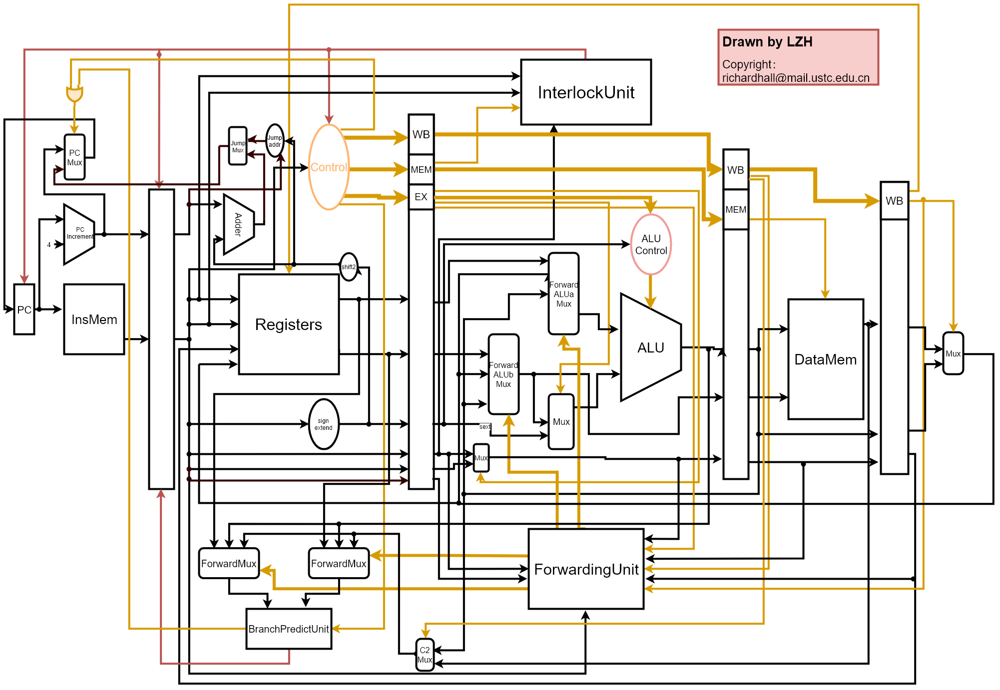

# Computer Organizartion Labs
---
Hi there! Here are my cod lab code!!
## lab1 [ALU](./lab1)
## lab2 [Divider](./lab2)
## lab3 [Queue and Stack](./lab3)
## lab4 [A VGA Painter](./lab4)
## lab5 [A CPU!](./lab5_final)
## lab6 [Implementation of CPU Instruction Pipelining Architecture on FPGA](./lab6) 
### Overview
 Based on Von Neumann architecture, used the Nexys™4 DDR Artix-7 FPGA Board from Xilinx, Hardware Description Language Verilog and Vivado 2018 (a software from Xilinx) to implement CPU Instruction pipelining architecture. 

### Implementation Details
+ Implemented First-order Forward, Second-order Forward, Branch Prediction, and Interlock. 
+  A test program is [bubble sort](./MIPS/BubbleSort.s).
+  Data path: 

